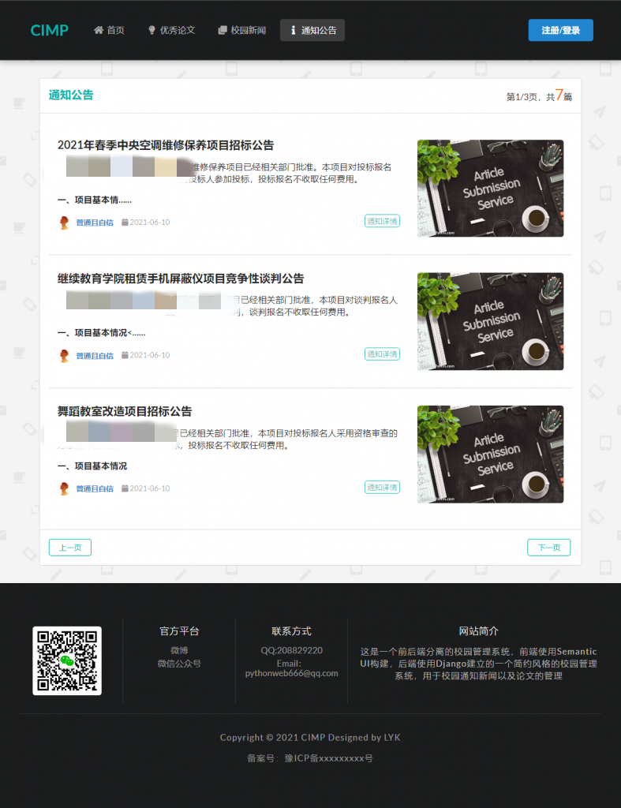
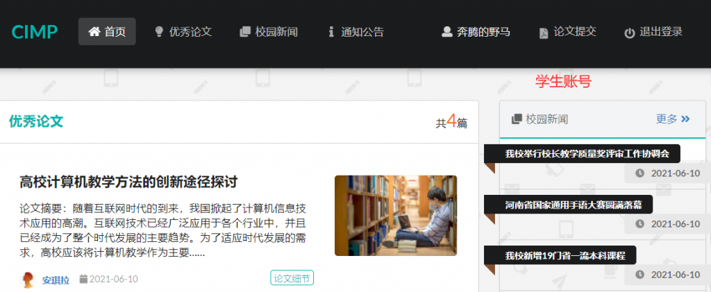

## 1 系统简介

校园信息管理平台（Campus Information Management Platform），简称 CIMP。

CIMP 实现了校园学生教师管理员账号、通知公告、校园新闻动态、学生毕业设计等数据的发布和管理。

其中内置了一个工作流系统，实现了毕业设计项目的申请、提交、修改、审批、评分功能。

## 2 技术选型

系统采用前后分离的模式进行开发，其架构图如下：

- 前端使用Semantic UI构建，vue.js驱动数据，echarts生成图表。
- 后端使用Django框架，api风格遵守RESTful规范。
- 服务端使用Nginx作为HTTP服务器，用于静态资源的管理。
- 数据库在开发阶段使用的是SQLite，如果项目有上线计划会改用MySQL
- 使用Redis作为缓存数据库，用于存储图形验证码结果
- 系统采用Token认证机制，支持多终端。

## 3 前台功能

前台也即是网站首页，不管是否为登录用户，都应该能正常查看网站内容

首页右侧显示最新发布的四篇学生论文的一段内容（50个字），点击详情可以查看完整论文。如果论文中有图片则会显示论文中的第一张图（头图）作为缩略图，如果没有图片则会显示默认的图片。首页左侧分别显示四条最新发布的校园新闻和通知公告，点击更多可以查看所有的通知公告、新闻及论文。

### 3.1 论文模块

默认会显示3条论文（点击详情可以查看完整论文），通过论文总数显示总页数和当前所在页（第x/n页），可以分页显示，论文按照发表的时间顺序排序（最新发表的在最前面）。论文中如果有头图，则会以头图作为缩略图，如果没有，则显示默认图片

点击论文详情，则会显示完整的论文内容（在弹出的新窗口中）

### 3.2 新闻模块

在显示格式上与论文并无不同（点击详情也与论文格式相同），不同的之处在于权限（后续在后台管理模块中会有体现），这里不再赘述

### 3.3 通知公告模块

与新闻模块相同，不再赘述

## 4 用户注册登录功能

### 4.1 用户注册

点击首页右上角的`注册/登录`按钮，跳转到登录页面

继续点击注册，跳转到注册界面

在注册页面中，用户名，密码，真实姓名和验证码是必填项，其他可以选择性填写，如果验证码错误，会自动刷新验证码（也可以点击图片刷新验证码），用户必须在五分钟之内完成注册，否则会提示验证码过期。点击注册，用户注册成功后自动登录，并跳转到首页

由于是学生用户，右上角会有一个论文提交的标签，如果是管理员用户，在相同位置会是后台管理，如果是教师位置，则会增加论文审批标签

### 4.2 用户登录

点击首页右上角的退出登录，登录退出后，点击`注册/登录`按钮，输入刚刚注册的账号

在账号密码及验证码无误的情况下即可成功登录并跳转到首页（需要在五分钟之内完成）

## 5 后台管理功能

切换到管理员账号admin，点击后台管理（只有管理员和教师可以进入后台管理）

后台首页的左边是用户的个人信息，右边是网站内容的环形饼状图统计

### 5.1 用户管理功能

可以通过搜索的方式检索指定的用户，比如说想要找到用户名中含有李明或王刚的用户可以搜索`李明 王刚`多个关键词要用空格隔开，也可以通过翻页的形式查看用户，默认每页显示五个用户。

对于用户的增删改查，查已经说过了，增加用户，系统不支持在后台添加用户，点击新增之后，会跳转到注册页面。

用户的删除，只有管理员用户才能删除用户。

用户的修改，点击修改，跳转到用户修改的页面

想要修改哪个就填哪个（不填不修改），对于用户的密码，考虑到安全性是加密存储在数据库中的，所以密码只能修改，不能查看。

再次回到用户管理界面，可以看到修改已经生效了

### 5.2 论文管理功能

对于论文来说也是可以通过关键词查找的（支持多个关键词，中间用空格隔开），论文不能在后台新增，只能由学生用户提交。同样论文也不允许管理员修改，点击查看会跳转到该论文的详情页面。论文也只有管理员用户才能删除。

### 5.3 新闻和通知管理功能

论文和新闻模块功能几乎相同，这里就放在一起说了

新闻和公告同样支持关键词查找（支持多个关键字，中间用空格隔开），新闻和公告管理员和教师可以删除。

点击新增，会跳转到新增页面

输入标题和内容即可发布通知，支持富文本编辑框，后台增加图片上传接口，可以粘贴图片或上传本地图片

对于新闻及通知的修改，点击编辑后，会跳转到富文本编辑器也面，同上图，默认加载修改前的内容，在修改之后，点击发布即可

## 6 论文的提交与审批功能

系统内置了一个工作流接口，规定了只有学生能够提交论文，且每个学生只能提交一篇论文，只有教师才能够审批论文。大致过程是学生创建论文主题，教师批准主题后（不批准需要再次修改提交），学生才能提交论文，教师对论文通过并评分后（不通过打回重做，学生需要再次提交），学生收到论文的评分，整个工作流结束。

使用两个不同的浏览器用来登录两个不同账号（一个学生，一个教师）

学生点击论文提交进入论文提交页面

除了创建主题什么都没有，这是因为学生当前还没有提交过论文，点击创建主题

输入主题和主题描述及选择好导师之后，点击创建主题

教师点击论文审批进入审批页面

能够显示出学生提交的主题以及主题描述了，先驳回主题

再次刷新学生论文提交页面

以及收到了教师的驳回主题以及驳回的理由，点击修改主题

提交修改之后，刷新教师论文审批页面

这次我们让他通过，回到学生页面

主题通过之后才可以创建论文

提交创建后的论文，回到教师界面

如果驳回论文的话，学生需要重新修改后再次提交（和主题被驳回过程一致），通过论文需要填写论文评分，这里我们直接让论文通过，回到学生页面

论文已通过，至此，整个工作流结束。

回到首页，这篇新发布的论文已经显示在首页了（只有审批通过的论文才会显示）

## 结语

该项目开源在Gitee上，地址https://gitee.com/i-ku/cimp

同时也提供了[接口文档](http://282931.xyz/?p=638)和[后端开发过程](http://282931.xyz/?p=640)供读者参考

需要前端或者对项目部署运行有什么疑问，欢迎加微信交流，微信：beyond-expression